# Control and Trajectory Tracking for Autonomous Vehicle

# Proportional-Integral-Derivative (PID)

In this project, you will apply the skills you have acquired in this course to design a PID controller to perform vehicle trajectory tracking. Given a trajectory as an array of locations, and a simulation environment, you will design and code a PID controller and test its efficiency on the CARLA simulator used in the industry.

### Installation

Run the following commands to install the starter code in the Udacity Workspace:

Clone the <a href="https://github.com/udacity/nd013-c6-control-starter/tree/master" target="_blank">repository</a>:

`git clone https://github.com/udacity/nd013-c6-control-starter.git`

## Run Carla Simulator

Open new window

* `su - student`
// Will say permission denied, ignore and continue
* `cd /opt/carla-simulator/`
* `SDL_VIDEODRIVER=offscreen ./CarlaUE4.sh -opengl`

## Compile and Run the Controller

Open new window

* `cd nd013-c6-control-starter/project`
* `./install-ubuntu.sh`
* `cd pid_controller/`
* `rm -rf rpclib`
* `git clone https://github.com/rpclib/rpclib.git`
* `cmake .`
* `make` (This last command compiles your c++ code, run it after every change in your code)

## Testing

To test your installation run the following commands.

* `cd nd013-c6-control-starter/project`
* `./run_main_pid.sh`
This will silently fail `ctrl + C` to stop
* `./run_main_pid.sh` (again)
Go to desktop mode to see CARLA

If error bind is already in use, or address already being used

* `ps -aux | grep carla`
* `kill id`


## Project Instructions

In the previous project you built a path planner for the autonomous vehicle. Now you will build the steer and throttle controller so that the car follows the trajectory.

You will design and run the a PID controller as described in the previous course.

In the directory [/pid_controller](https://github.com/udacity/nd013-c6-control-starter/tree/master/project/pid_controller)  you will find the files [pid_controller.cpp](https://github.com/udacity/nd013-c6-control-starter/blob/master/project/pid_controller/pid_controller.cpp)  and [pid_controller.h](https://github.com/udacity/nd013-c6-control-starter/blob/master/project/pid_controller/pid_controller.h). This is where you will code your pid controller.
The function pid is called in [main.cpp](https://github.com/udacity/nd013-c6-control-starter/blob/master/project/pid_controller/main.cpp).

### Step 1: Build the PID controller object
Complete the TODO in the [pid_controller.h](https://github.com/udacity/nd013-c6-control-starter/blob/master/project/pid_controller/pid_controller.h) and [pid_controller.cpp](https://github.com/udacity/nd013-c6-control-starter/blob/master/project/pid_controller/pid_controller.cpp).

Run the simulator and see in the desktop mode the car in the CARLA simulator. Take a screenshot and add it to your report. The car should not move in the simulation.

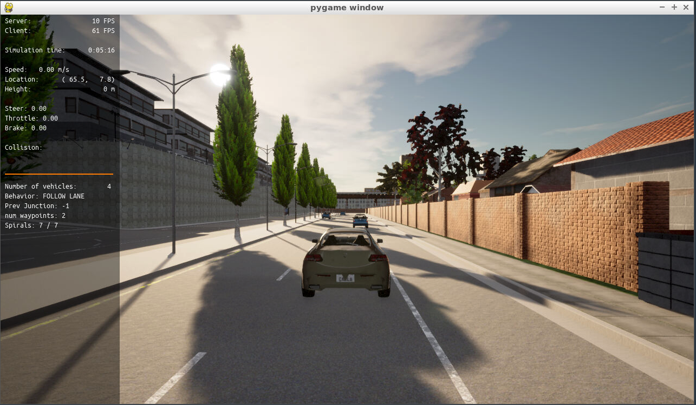

### Step 2: PID controller for throttle:
1) In [main.cpp](https://github.com/udacity/nd013-c6-control-starter/blob/master/project/pid_controller/main.cpp), complete the TODO (step 2) to compute the error for the throttle pid. The error is the speed difference between the actual speed and the desired speed.

Useful variables:
- The last point of **v_points** vector contains the velocity computed by the path planner.
- **velocity** contains the actual velocity.
- The output of the controller should be inside [-1, 1].

2) Comment your code to explain why did you computed the error this way.

3) Tune the parameters of the pid until you get satisfying results (a perfect trajectory is not expected).

### Step 3: PID controller for steer:
1) In [main.cpp](https://github.com/udacity/nd013-c6-control-starter/blob/master/project/pid_controller/main.cpp), complete the TODO (step 3) to compute the error for the steer pid. The error is the angle difference between the actual steer and the desired steer to reach the planned position.

Useful variables:
- The variable **y_points** and **x_point** gives the desired trajectory planned by the path_planner.
- **yaw** gives the actual rotational angle of the car.
- The output of the controller should be inside [-1.2, 1.2].
- If needed, the position of the car is stored in the variables **x_position**, **y_position** and **z_position**

2) Comment your code to explain why did you computed the error this way.

3) Tune the parameters of the pid until you get satisfying results (a perfect trajectory is not expected).

### Step 4: Evaluate the PID efficiency
The values of the error and the pid command are saved in thottle_data.txt and steer_data.txt.
Plot the saved values using the command (in nd013-c6-control-refresh/project):

```
python3 plot_pid.py
```

You might need to install a few additional python modules: 

```
pip3 install pandas
pip3 install matplotlib
```

Answer the following questions:
- Add the plots to your report and explain them (describe what you see)
  - First, we could reference the influence after increasing the K_p, K_i and K_d from [Wiki: PID Controller](https://en.wikipedia.org/wiki/PID_controller).
 
    
    
    - As we can see, enlarge the K_p or K_i will increase the overshoot and also decrease the stability.
    - The other way, enlarge the K_d will decrease the overshoot.

    Refer to the observation above, we could have some experiment on the parameter of steering.
    (Based on the same throttle parameters)
    - parameter for throttling: K_p=0.2, K_i=0.0009, K_d=0.1, limit_min=-1.0, limit_max=1.0
    - After some observation, we could use a slightly large K_p and K_i to increase the rise time, and large K_d to decrease overshooting. The manual tuning from observation is the last row of our table.
    
    
    |Experiment name|K_p|K_i|k_d|steering|throttle|
    |-|-|-|-|-|-|
    |Test K_d 1| 0.2 | 0.0001| 0.2| 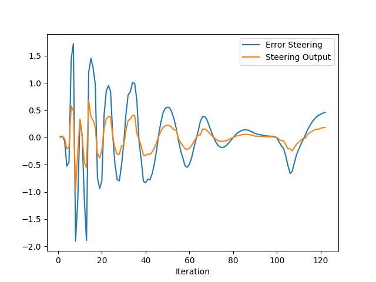| 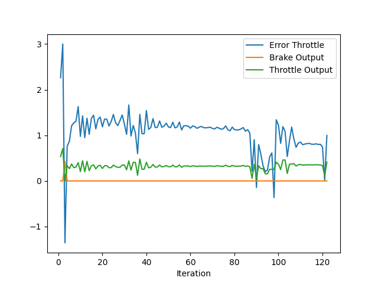|
    |Test K_d 2| 0.2 | 0.0001| 0.3| 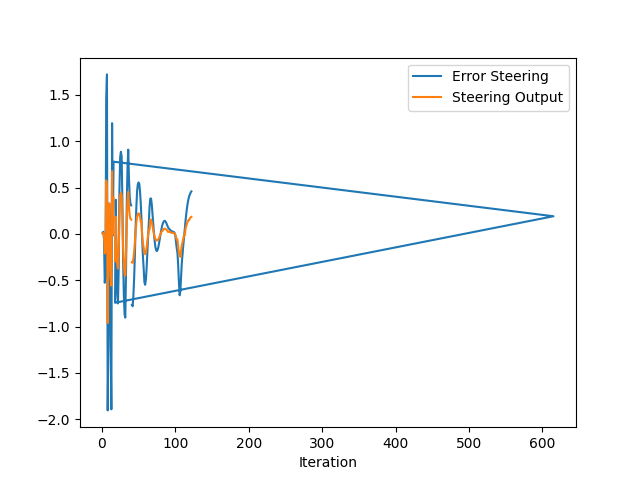| 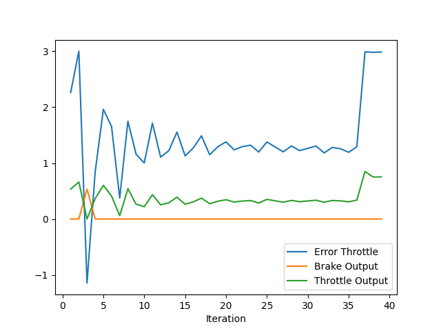|
    |Test K_d 3| 0.2 | 0.0001| 0.4| 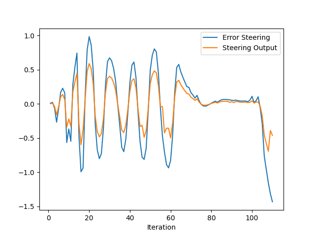| 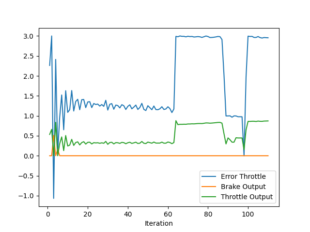|
    |Test K_i 1| 0.2 | 0.0005| 0.2| 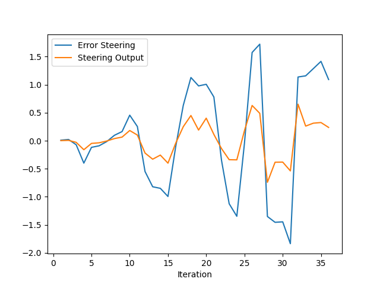| 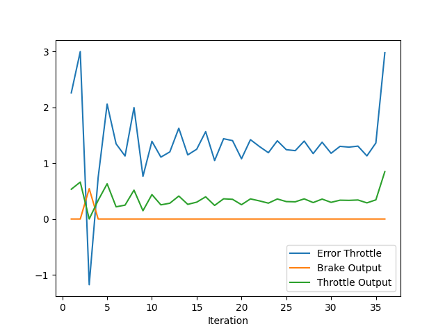|
    |Test K_i 2| 0.2 | 0.001| 0.2| 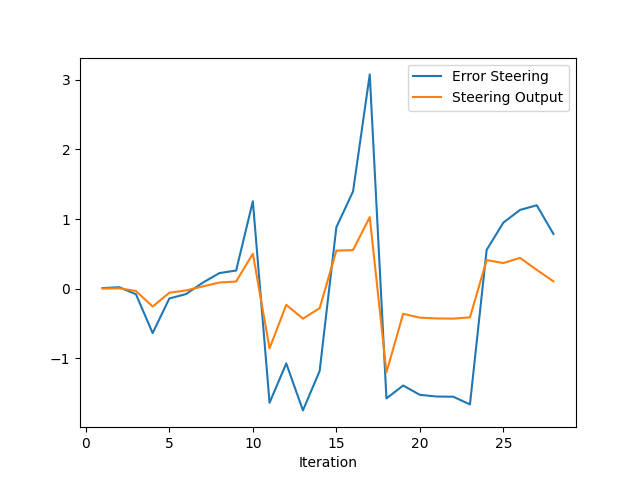| 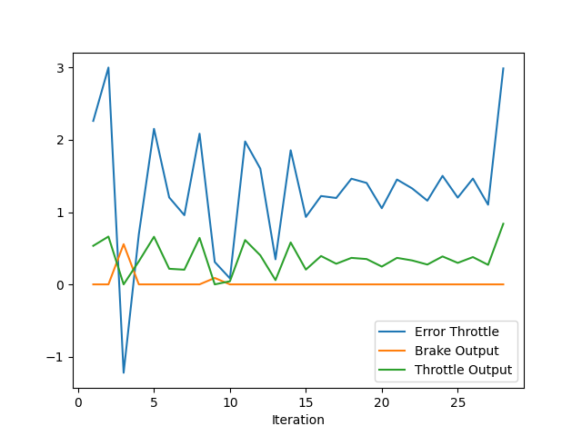|
    |Test K_i 3| 0.2 | 0.005| 0.2| 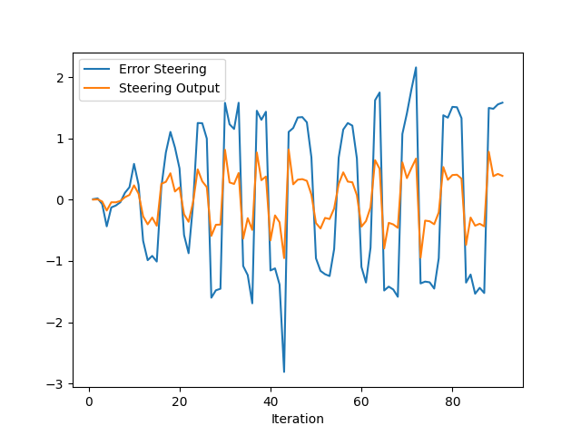| 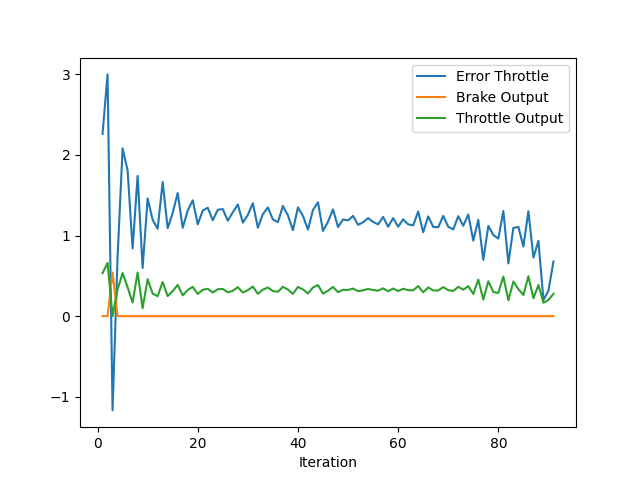|
    |Test K_p 1| 0.1 | 0.0001| 0.2| 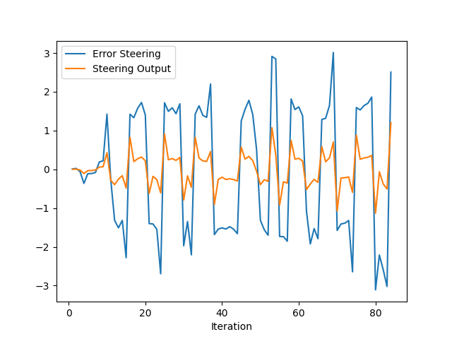| 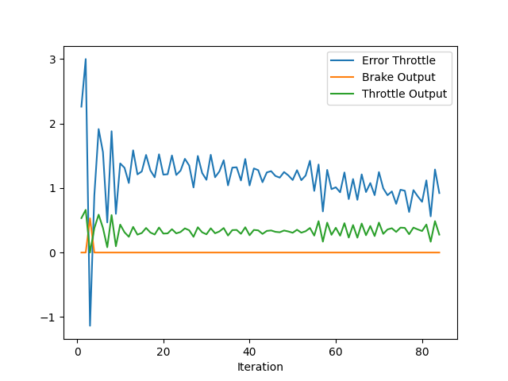|
    |Test K_p 2| 0.4 | 0.0001| 0.2| 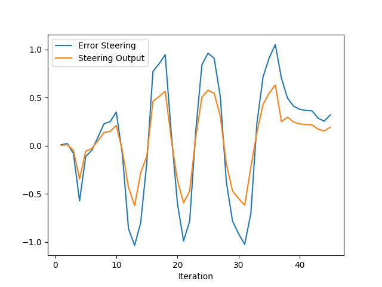| 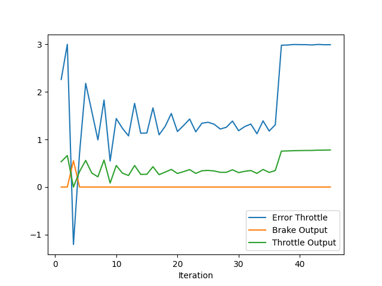|
    |Manual Tuning| 0.22 | 0.0005| 0.8| 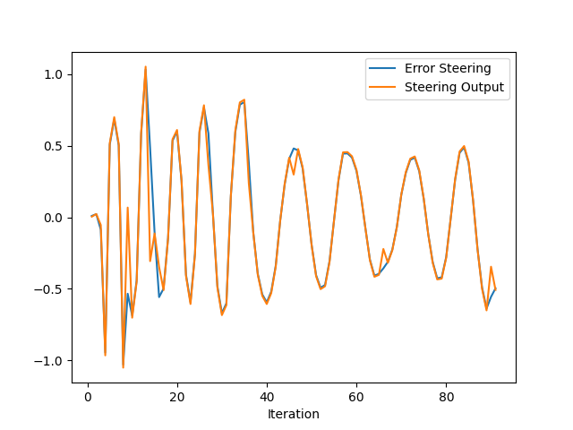| 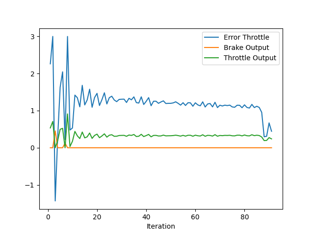|
    
- What is the effect of the PID according to the plots, how each part of the PID affects the control command?
  - Term $P$: Large $P$ value will give the car a large change on the outout.
  - Term $I$: Because it's relate to cumulative error, a large $I$ will elimiate the system bias over time.
  - Term $D$: Large $D$ will help us to decrease the settling time and also increase the stability.

- How would you design a way to automatically tune the PID parameters?

  > [Twiddle algorithm](https://martin-thoma.com/twiddle/) is probably a good method to auto tune the parameters. 
  
- PID controller is a model free controller, i.e. it does not use a model of the car. Could you explain the pros and cons of this type of controller?

  - Pros
    - Easy to implement.
    - Efficient and robust on some condition.
    - Only depend on the error between the desired signals and controlled signals. No further sensor information needed.
  - Cons
    - Difficult to handle those variables with strong interactions.
    - Low performance to handle strong non-linearities.
  
- (Optional) What would you do to improve the PID controller?
  - Experience from this project, it's really hard to tune the parameters to perform a "perfect" control manually. So the auto-tune techinics is necessary for us to decrease the tuning time.

### Tips:

- When you wil be testing your c++ code, restart the Carla simulator to remove the former car from the simulation.
- If the simulation freezes on the desktop mode but is still running on the terminal, close the desktop and restart it.
- When you will be tuning the PID parameters, try between those values:

